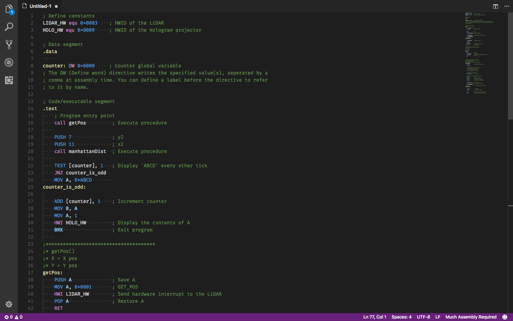
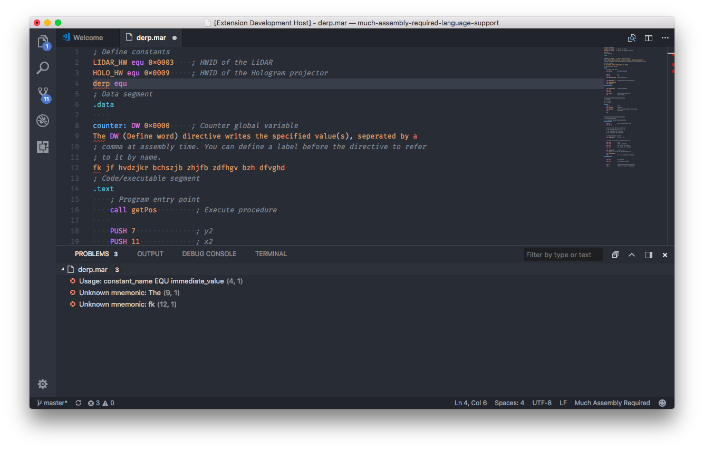
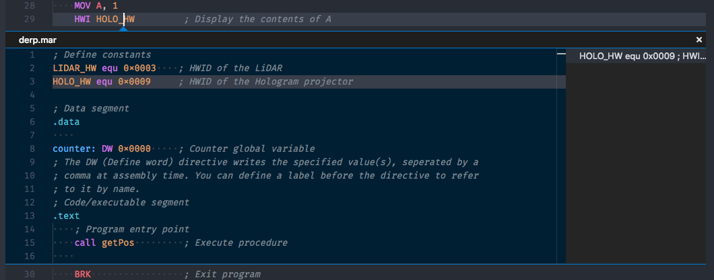

# Much Assembly Required Language Support for VSCode

This VSCode extension adds basic language functionality for the 8086-like language used in the game [Much Assembly Required](https://muchassemblyrequired.com).

## Features

**Syntax Highlighting:**

**Linting:**

**Go to Definition:**

## Release Notes

### 0.1.2

* Made the linter not trigger on non-`.mar` files.

### 0.1.0

* Linting
* Go to definition
* Hover hints

### 0.0.1

It exists!
